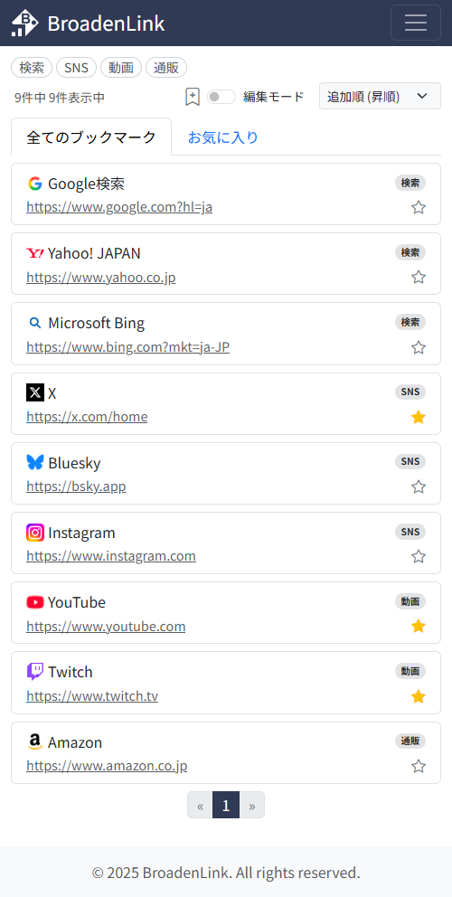
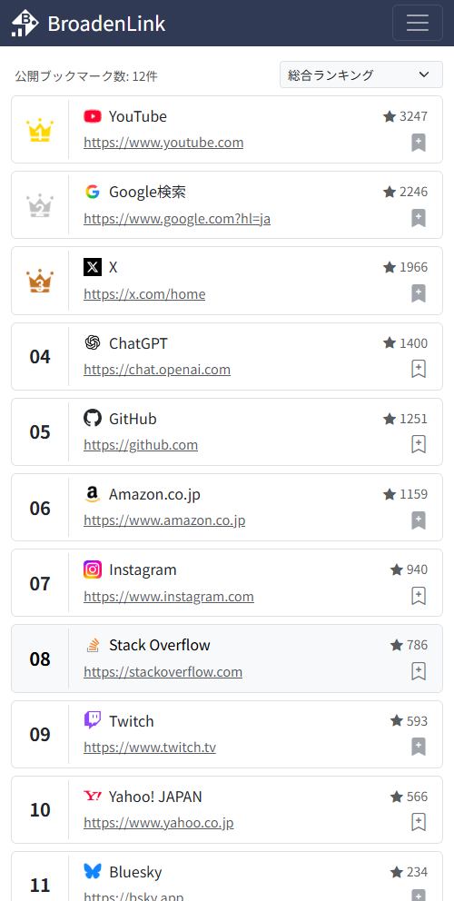
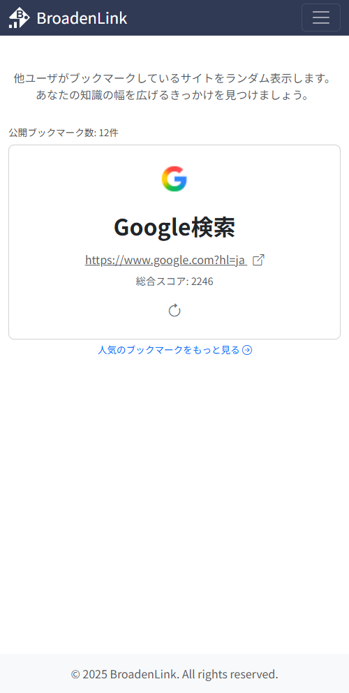
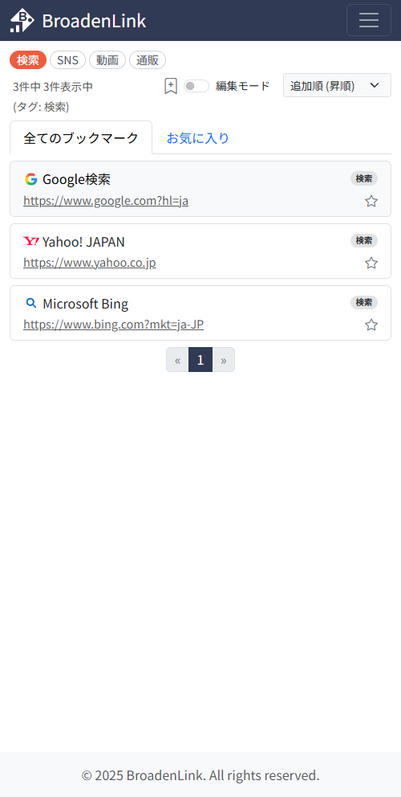
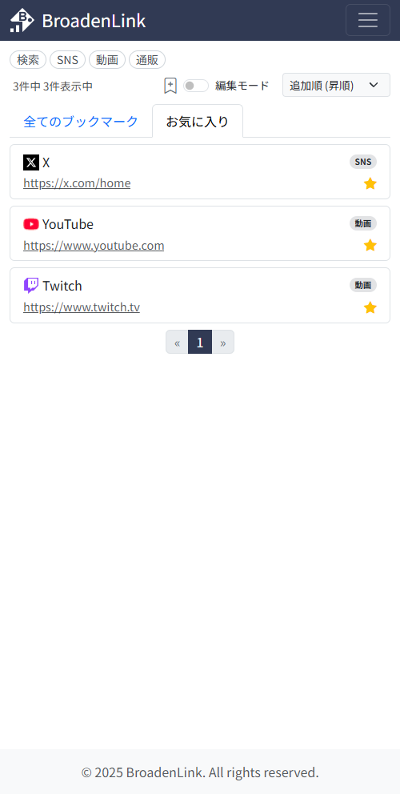
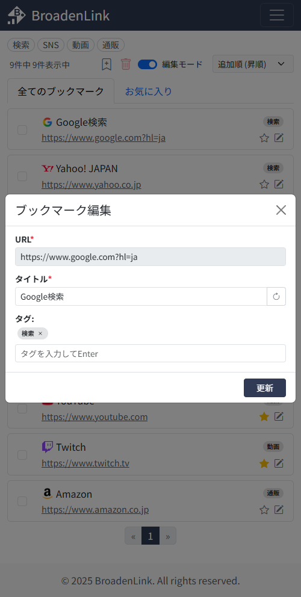
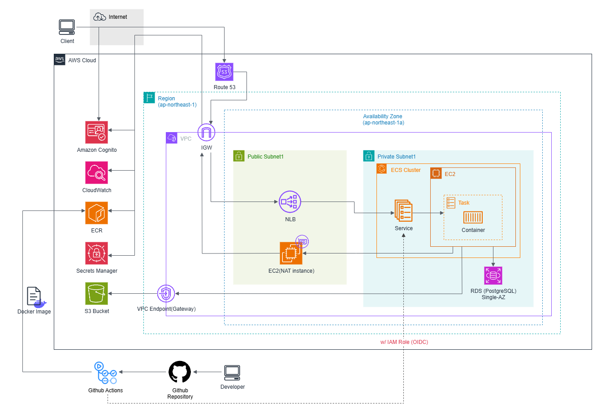
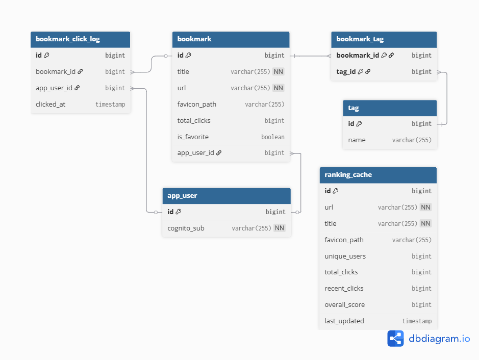

  

 

# BroadenLink:ブックマーク管理Webアプリケーション

## プロジェクト概要
本プロジェクトは、Java/SpringBootを用いたWebアプリケーション開発において、私が習得したスキルと経験を実践する場として構築されました。
GEMINI CLIを用いたAI駆動開発の手法を取り入れ、実装からAWSを活用したクラウドインフラの構築まで、一連の開発プロセスに取り組み、Webアプリケーション開発の理解を深めました。

## サービス概要
BroadenLinkは、Web上の情報を効率的に管理し、新たな知識を発見するためのブックマーク管理Webアプリケーションです。
ユーザーが求める情報へ即座にアクセスできる「フラットな操作感」を重視し、タグやお気に入り機能による素早い検索・整理を可能にしています。
また、他のユーザーがブックマークしている人気サイトを探索することで、個人の知見を広げ、情報収集の幅を拡大することを支援します。

<!--  -->

 
👉アプリケーションを試す: [https://broadenlink.com/about](https://broadenlink.com/about) ~※現在、運用を一時停止しています~

### 主な特徴
* **ブックマークの登録と編集**:
URLを入力するだけで、Webサイトのタイトルやファビコンを自動で取得し、ブックマークとして登録できます。登録後の編集や一括削除も可能です。
* **効率的な整理と検索**:
ブックマークにはタグを付与でき、お気に入り設定も可能です。キーワード、タグ、お気に入り状態を組み合わせてブックマークを検索・絞り込み表示できます。
* **他ユーザーのブックマーク探索**:
ユニークユーザー数、総クリック数、総合スコアなどに基づいたランキング形式で、人気のブックマークを閲覧できます。また、ランダムにブックマークを提示するBroaden機能を通じて、新しい情報源を発見できます。
* **ユーザー認証とシステム基盤**:
AWS Cognitoと連携したユーザー認証システムにより、サービスを利用できます。アプリケーションはクラウド環境に構築されており、基本的な動作環境を提供します。

## アプリケーションプレビュー

### 主要画面
<table>
  <tr>
    <td align="center">
      
    </td>
    <td align="center">
      
    </td>
    <td align="center">
      
    </td>
  </tr>
  <tr>
    <td align="center">
      メイン画面
    </td>
    <td align="center">
      ランキング画面
    </td>
    <td align="center">
      Broaden画面
    </td>
  </tr>
</table>

### メイン画面の機能
<table>
  <tr>
    <td align="center">
      
    </td>
    <td align="center">
      
    </td>
    <td align="center">
      
    </td>
  </tr>
  <tr>
    <td align="center">
      タブ利用時
    </td>
    <td align="center">
      お気に入り利用時
    </td>
    <td align="center">
      ブックマーク編集時
    </td>
  </tr>
</table>

## システムアーキテクチャ
本アプリケーションは、以下のAWSサービスを組み合わせて構築されています。

※運用コストの観点から、現在は単一構成を採用しています。

### データベース設計
本アプリケーションのデータは、以下のテーブル構造で管理されています。

## 定期処理
本アプリケーションでは、以下の定期処理が実行されます。

* **ランキングキャッシュの更新**:
  * **目的**: ランキングページの表示パフォーマンス向上のため、ブックマークのユニークユーザー数、総クリック数、直近クリック数、総合スコアに基づいたランキングデータを毎日再集計し、キャッシュします。
  * **実行頻度**: 毎日午前4時 (JST)
* **古いクリックログのクリーンアップ**:
  * **目的**: データベースの肥大化を防ぐため、1ヶ月以上前のブックマーククリックログを定期的に削除します。
  * **実行頻度**: 毎日午前3時 (JST)

## 主要技術スタック
* **バックエンド**:
  * Java 17: プログラミング言語
  * Spring Boot 3.x: Webアプリケーションフレームワーク
  * Spring Data JPA: データ永続化層の実装に利用
  * Spring Security: 認証・認可機能を提供
  * Thymeleaf: サーバーサイドテンプレートエンジン
  * JSoup: Webコンテンツの解析に利用
* **データベース**:
  * PostgreSQL (AWS RDS, Docker): 本番環境およびローカル開発環境のデータベース
  * H2 Database (開発・テスト用): 開発およびテスト時のインメモリデータベース
* **フロントエンド**:
  * Bootstrap 5: レスポンシブデザイン対応のUIフレームワーク
* **クラウドインフラ (AWS)**:
  * コンテナ: Amazon ECS (EC2), Amazon ECR: コンテナ化されたアプリケーションのデプロイと管理
  * データベース: Amazon RDS for PostgreSQL: マネージド型リレーショナルデータベースサービス
  * ストレージ: Amazon S3: オブジェクトストレージサービス
  * 認証: Amazon Cognito: ユーザー認証およびディレクトリサービス
  * セキュリティ: AWS Secrets Manager: 機密情報の管理
  * ネットワーク: Amazon VPC, Network Load Balancer (NLB), NAT Instance, Route 53, Internet Gateway: ネットワークインフラの構築
  * モニタリング: Amazon CloudWatch: リソースおよびアプリケーションの監視
* **CI/CD・コンテナ**:
  * GitHub Actions: 継続的インテグレーションおよびデプロイの自動化
  * Docker: アプリケーションのコンテナ化
* **開発ツール**:
  * VS Code: 統合開発環境 (IDE)
  * Maven: プロジェクト管理およびビルドツール
  * Gemini CLI: AI駆動開発ツール
  * GitHub: Gitリポジトリホスティングサービス

## 開発・デプロイプロセス
1. **ソースコード管理**: GitHubを利用し、バージョン管理を実施（mainブランチを本番環境用、developブランチを開発用として運用）。
2. **CI/CD**: GitHub Actionsを利用し、以下のプロセスを自動化。
   - mainブランチへのプッシュ/プルリクエストをトリガーに、Mavenによるビルドとテストを実行。
   - OIDC (OpenID Connect) を利用したAWS認証により、GitHub ActionsからAWSリソースへアクセス。
   - ビルド成功後、Dockerイメージをビルドし、Amazon ECRへプッシュ。
   - 最新のDockerイメージを使用し、Amazon ECSサービスを更新・デプロイ。
3. **ホスティング**: AWS ECS (EC2起動タイプ) 上でSpring Bootアプリケーションをコンテナとして実行。
4. **データベース接続**: AWS Secrets ManagerからRDSの認証情報を取得し、アプリケーションからデータベースへ接続。
5. **静的ファイル管理**: ファビコンなどの静的ファイルをAmazon S3に保存。
